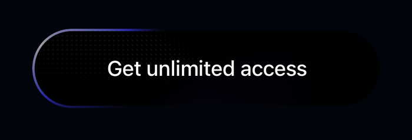

# Opal — shiny call-to-action button

A React Native reproduction of Ryan Mulligan's
[Shiny call-to-action button](https://codepen.io/hexagoncircle/pen/MWMqXbK),
rebuilt with [Skia](https://shopify.github.io/react-native-skia/) because the
original relies on CSS features React Native has no equivalent for.



## What it demonstrates

A pill-shaped CTA with four layers of motion running at once:

- a **conic highlight orbiting the border**, one revolution every 3 s;
- a **dot grid** that is only lit where the halo passes over it — everywhere
  else the button stays black;
- an **inner shimmer**, a soft crescent that orbits with the halo;
- a **glow under the label** that blooms while the button is held.

The original is driven by CSS `@property`-animated `conic-gradient()`. React
Native has neither `@property` nor conic gradients, so every layer is drawn in
a Skia canvas — `SweepGradient` being the direct native counterpart.

Because touch has no hover, the CSS `:hover` / `:focus` state is mapped to
**press-and-hold**: hold the button to widen the highlight band and raise the
glow.

## Requirements

- Node 20+
- Xcode 16+ with an iOS 18 simulator
- macOS (the iOS target is the one that is verified)

## Running it

```bash
npm install
```

```bash
npm run ios
```

This is a **development build**, not Expo Go: `@shopify/react-native-skia` ships
native code, so the app has to be compiled. `npm run ios` runs
`expo run:ios`, which builds and installs it.

> If CocoaPods fails with `Unicode Normalization not appropriate for ASCII-8BIT`,
> export a UTF-8 locale first: `export LANG=en_US.UTF-8 LC_ALL=en_US.UTF-8`.

## Platform support

| Platform | Status |
|---|---|
| iOS | Verified on the simulator (iPhone 17, iOS 18). |
| Android | Should work — Skia and Reanimated are cross-platform and nothing here is iOS-specific — but it has not been run or verified. |
| Web | Not supported. Skia on web needs the CanvasKit setup, which is not configured here. |

## Known limitations

- The button is a **fixed 300×68 pt**. The geometry constants derive from those
  two numbers, so it does not reflow to its label; changing the text means
  changing `WIDTH`.
- The glow is a blurred circle rather than the CSS inset `box-shadow`. It reads
  the same at rest and while held, but it is an approximation, not a port.
- **Press-and-hold is not the same as hover.** The CSS runs the active state
  while the pointer merely rests on the button; here it needs a finger down.
- Four lint errors are suppressed in `use-shiny-button-animation.ts`. The React
  Compiler's `react-hooks/immutability` rule does not model Reanimated shared
  values, which are mutable refs by design; the suppression is scoped to the two
  press handlers and documented in place.

## Project layout

```
src/
  app/                          expo-router routes (routes only)
    _layout.tsx                 root stack, dark background
    index.tsx                   the single screen
  components/
    shiny-button.tsx            rendering only — the Skia tree
  hooks/
    use-shiny-button-animation.ts   all motion: shared values, frame loop
  constants/
    shiny-button.ts             geometry, palette, timings
```

For the architecture, the CSS→Skia mapping and the pitfalls hit while building
this, see [AGENTS.md](AGENTS.md).
